# MeshLite — Architecture Documentation

> **Version:** 1.0 — Phase 5 MVP Architecture  
> **Components:** Sigil (Control Plane) · Kprobe (eBPF Enforcer) · Conduit (Gateway) · Trace (Observability Dashboard)

---

## Table of Contents

1. [What MeshLite Is](#1-what-meshlite-is)
2. [Core Design Principles](#2-core-design-principles)
3. [C4 Level 1 — System Context](#3-c4-level-1--system-context)
4. [C4 Level 2 — Container Diagram](#4-c4-level-2--container-diagram)
5. [C4 Level 3 — Component Diagram](#5-c4-level-3--component-diagram)
6. [Class Diagrams](#6-class-diagrams)
7. [Same-Cluster — Request Flow](#7-same-cluster--request-flow)
8. [Cross-Cluster — Request Flow](#8-cross-cluster--request-flow)
9. [Certificate Lifecycle](#9-certificate-lifecycle)
10. [Policy Enforcement Model](#10-policy-enforcement-model)
11. [Observability Architecture](#11-observability-architecture)

---

## 1. What MeshLite Is

MeshLite is a **Zero Trust Networking tool for Kubernetes** that handles the security and observability layer of a service mesh without the operational overhead of running a full mesh like Istio.

It operates at two levels:

- **Kernel level** via Kprobe (eBPF) — for traffic between services inside the same cluster
- **Network boundary level** via Conduit gateways — for traffic crossing between separate clusters

Neither the sending service nor the receiving service changes any code. MeshLite is entirely transparent to application workloads.

---

## 2. Core Design Principles

| Principle | What it means in practice |
|---|---|
| **Zero application change** | Services write and receive plain HTTP. MeshLite handles encryption beneath them |
| **Kernel-first for intra-cluster** | Kprobe (eBPF) intercepts at the kernel tc layer — no sidecar, no extra process per pod |
| **Gateway-first for cross-cluster** | Conduit sits at the cluster edge where eBPF cannot reach |
| **Centralised identity** | Sigil is the single Certificate Authority — all certs flow from here |
| **Declarative config** | One `mesh.yaml` describes the entire security posture |
| **Observability as a byproduct** | Kprobe already sees every packet — metrics collection adds no overhead |

---

## 3. C4 Level 1 — System Context

> **What this shows:** The big picture — who uses MeshLite, what lives inside it, and what external systems it connects to. No internals yet.

### 3.1 Same-Cluster Context

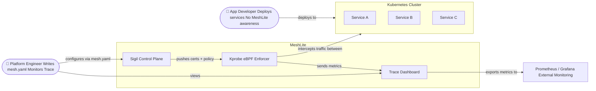

---

### 3.2 Cross-Cluster Context

> **Key point:** Sigil lives **inside MeshLite** — it is our control plane, not an external system. Both clusters connect to the same Sigil instance. This shared root is what lets them verify each other's certificates.

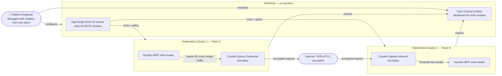

---

## 4. C4 Level 2 — Container Diagram

> **What this shows:** The actual deployable units — what runs as a process, where it runs in the cluster, and how the pieces talk to each other.

### 4.1 Same-Cluster — What Runs Where

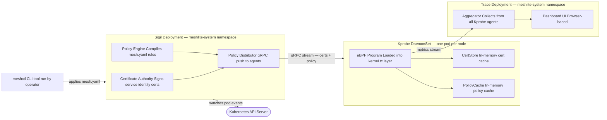

---

### 4.2 Cross-Cluster — What Runs Where

> Sigil runs once — hosted by us or self-hosted (Enterprise). Both clusters connect to it. Conduit runs at the edge of each cluster.

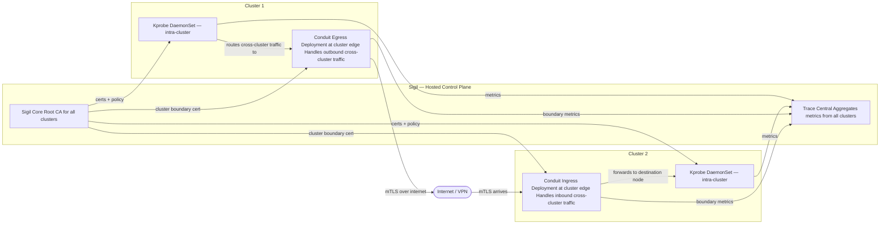

---

## 5. C4 Level 3 — Component Diagram

> **What this shows:** The internal sub-components inside each deployable unit. Opening the hood on each container from the previous section.

### 5.1 Inside Sigil

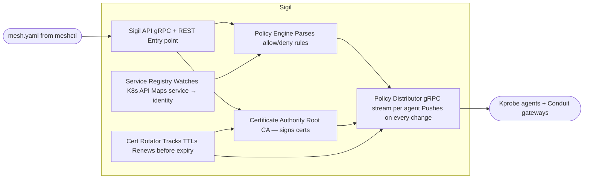

---

### 5.2 Inside Kprobe

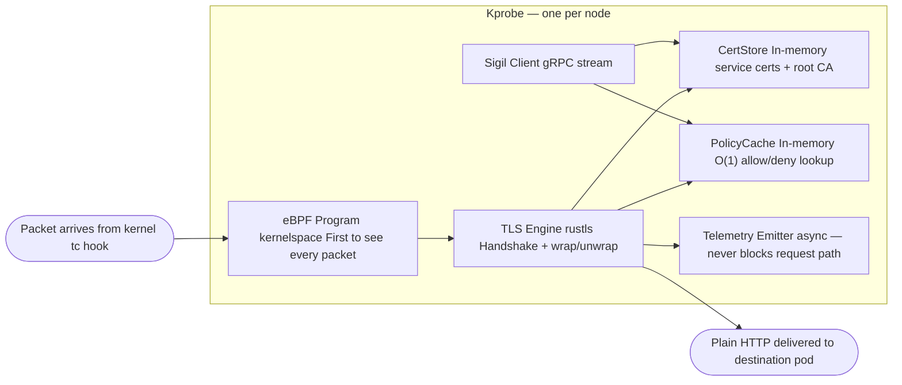

---

### 5.3 Inside Conduit

> Conduit Egress and Conduit Ingress are the same binary — direction determines behaviour.

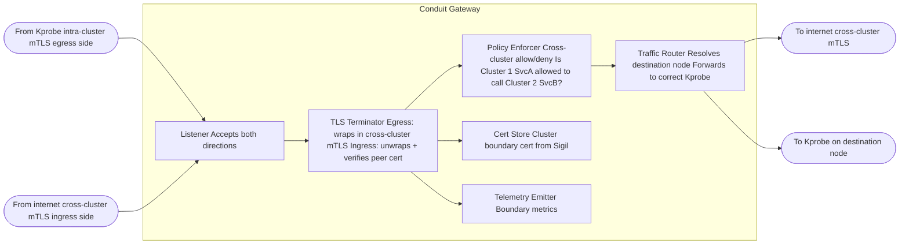

---

## 6. Class Diagrams

### 6.1 Certificate and Identity — Core Domain

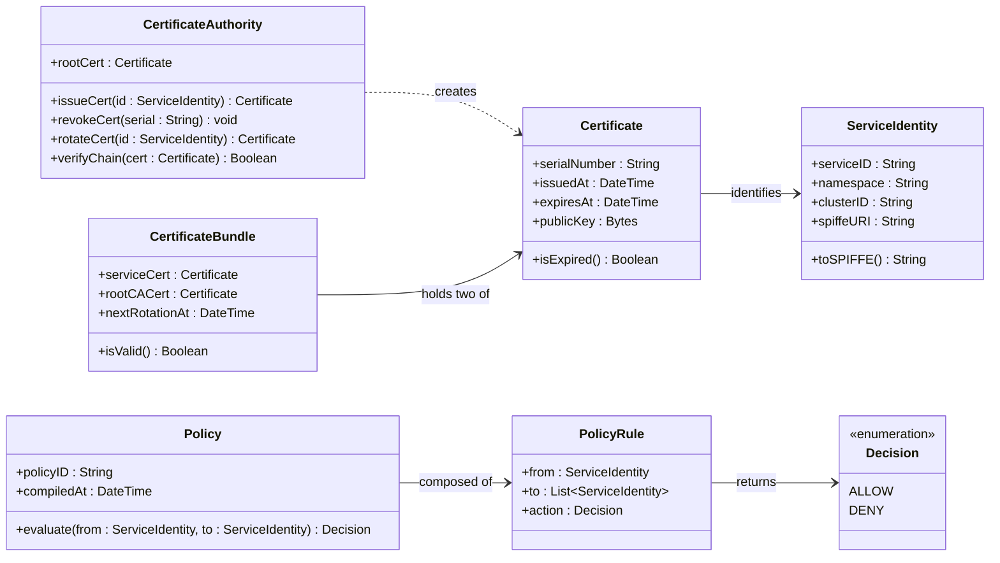

---

### 6.2 Kprobe — Packet and Enforcement Model

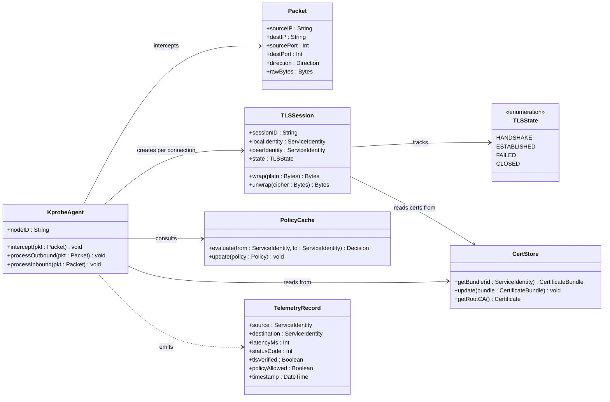

---

### 6.3 MeshConfig — What mesh.yaml Becomes in Code

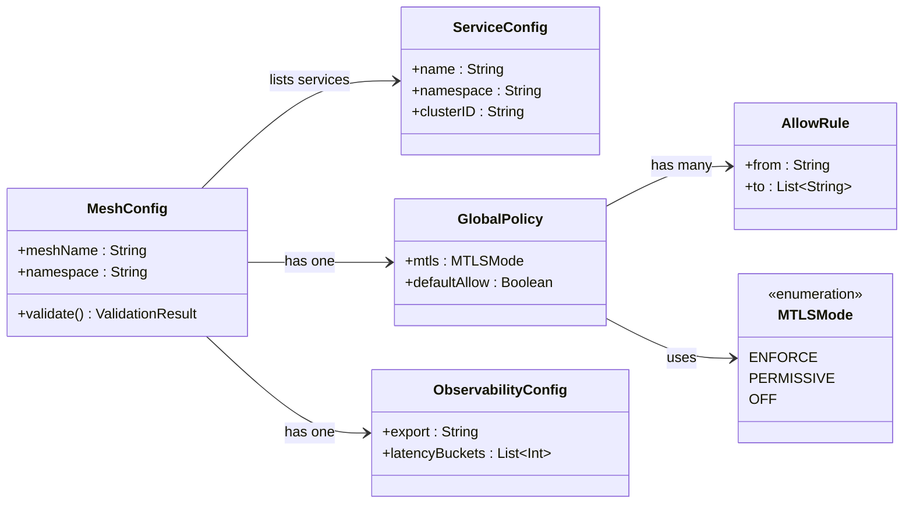

---

## 7. Same-Cluster — Request Flow

### 7.1 Where Kprobe sits in the Linux networking stack

> Before the request flow, understand exactly where Kprobe intercepts. It hooks into the **tc (traffic control) layer** — lower than any sidecar, higher than the physical wire. This is what makes zero-sidecar possible.

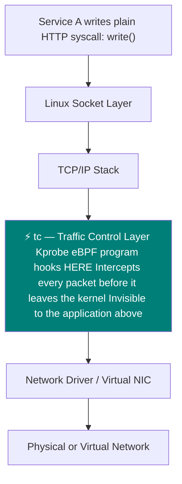

---

### 7.2 Same-cluster same-node request

> Both services happen to be scheduled on the same Kubernetes node. The entire flow stays inside one kernel.

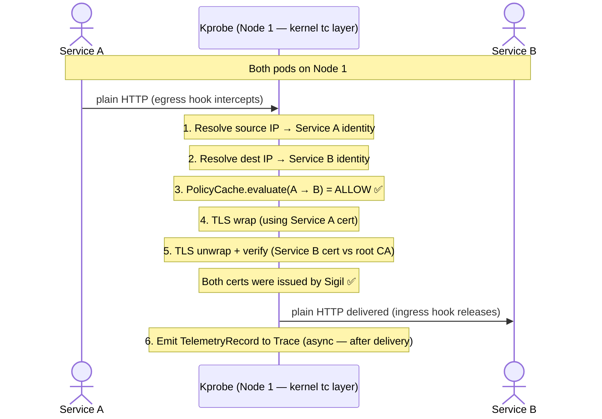

---

### 7.3 Same-cluster cross-node request

> Services are on different nodes. The packet physically travels across the cluster network — Kprobe on each node handles its own side of the mTLS handshake.

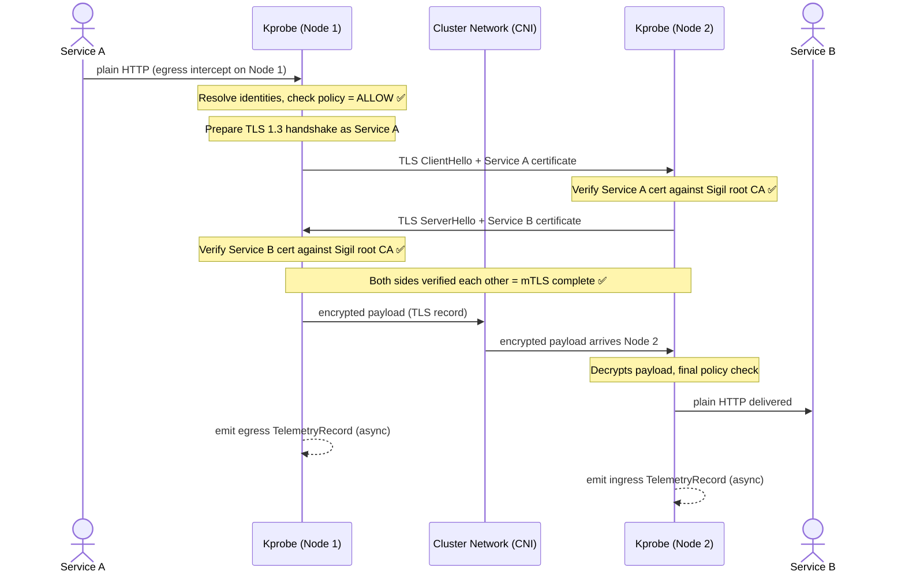

---

### 7.4 Kprobe startup — how it gets its certs and policy

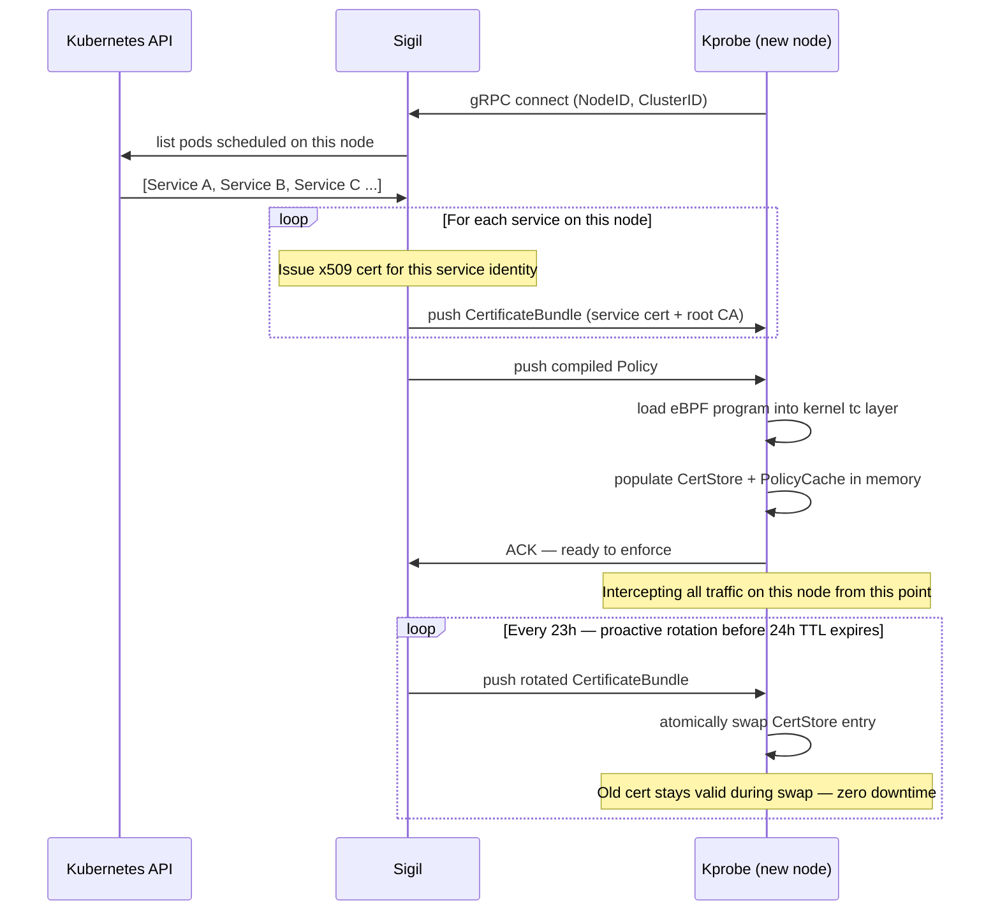

---

## 8. Cross-Cluster — Request Flow

### 8.1 Why eBPF stops at the cluster boundary

> eBPF runs inside a specific kernel on a specific node. Once a packet leaves that cluster and travels the internet to another cluster, there is no eBPF instance that can intercept it. Conduit is the bridge.

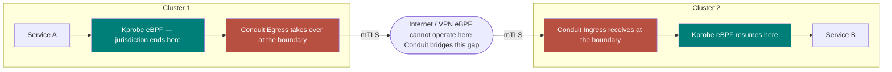

---

### 8.2 How Conduit gets its certificates — bootstrap before any request

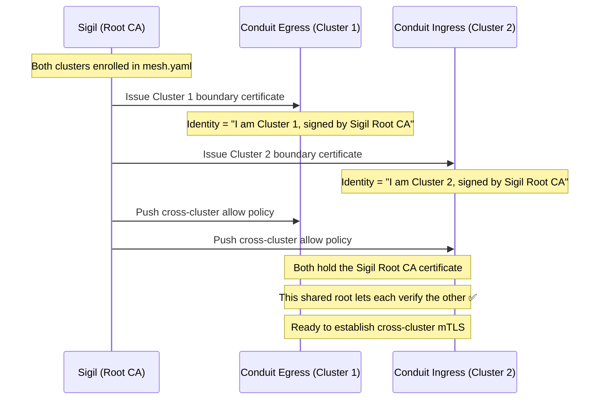

---

### 8.3 Full cross-cluster request — end to end

> Read top to bottom. Each component hands off to the next. The application (Service A and Service B) is completely unaware of everything in between.

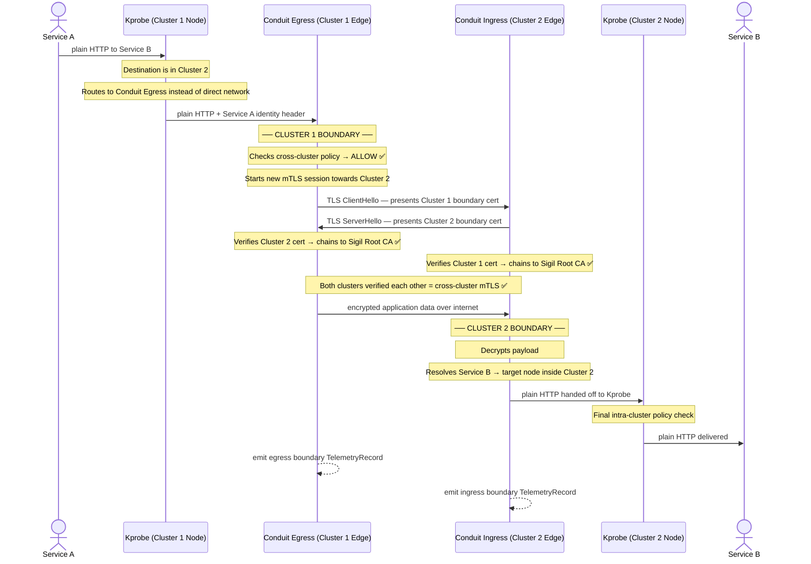

---

### 8.4 Why cross-cluster verification works — certificate chain

> Both clusters chain to the same Sigil Root CA. That is the entire reason Cluster 2 can verify a certificate it has never seen before from Cluster 1 — they share a parent.

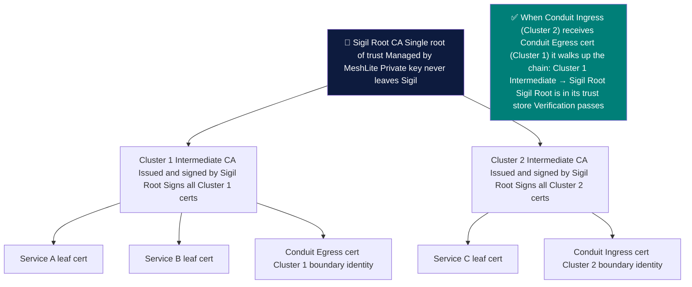

---

## 9. Certificate Lifecycle

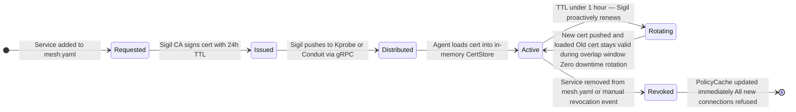

---

## 10. Policy Enforcement Model

### 10.1 From mesh.yaml to in-memory enforcement

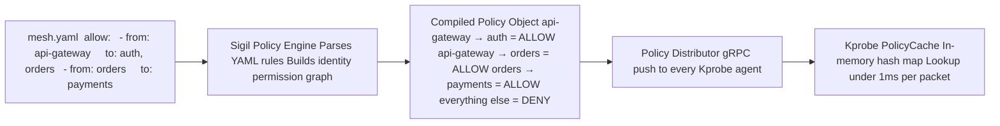

---

### 10.2 Decision tree — every single packet

```mermaid
graph LR
    A["Packet intercepted by eBPF tc hook"]
    B["Resolve source pod → ServiceIdentity"]
    C["Resolve dest pod → ServiceIdentity"]
    D{mTLS mode?}
    E["Start TLS 1.3 handshake"]
    F{Peer cert valid? Signed by Sigil root?}
    G{Policy allows this src → dst?}
    H["✅ Forward payload to destination pod"]
    J["❌ DROP Invalid cert Alert sent to Trace"]
    K["❌ DROP Policy denied Metric sent to Trace"]

    A --> B --> C --> D
    D -->|ENFORCE| E --> F
    F -->|YES| G
    F -->|NO| J
    D -->|PERMISSIVE| G
    G -->|ALLOW| H
    G -->|DENY| K
```

---

## 11. Observability Architecture

### 11.1 How Trace collects data without any app changes

```mermaid
graph LR
    subgraph N1 ["Node 1"]
        KP1["Kprobe sees same-cluster traffic"]
        TE1["Async emitter best-effort only"]
        KP1 -->|HTTP/JSON telemetry| TE1
    end

    subgraph N2 ["Node 2"]
        KP2["Kprobe"]
        TE2["Async emitter"]
        KP2 -->|HTTP/JSON telemetry| TE2
    end

    subgraph EDGE ["Cluster Boundary"]
        CE_T["Conduit Egress owns cross-cluster outcome"]
        CI_T["Conduit Ingress reports TLS / routing failures"]
    end

    subgraph TRACE ["Trace"]
        AGG["In-memory aggregator"]
        API["/summary /topology /events"]
        PROM["/metrics Prometheus endpoint"]
        UI["Rancher-inspired dashboard"]
        AGG --> API
        AGG --> PROM
        API --> UI
    end

    CLI["meshctl"]
    EXT["Prometheus / Grafana"]

    TE1 -->|POST /api/v1/telemetry| AGG
    TE2 -->|POST /api/v1/telemetry| AGG
    CE_T -->|POST /api/v1/telemetry| AGG
    CI_T -->|POST /api/v1/telemetry| AGG
    CLI -->|reads Trace + Sigil APIs| API
    PROM --> EXT
```

---

### 11.2 `TelemetryRecord` — what every request produces

```mermaid
classDiagram
    direction LR

    class TelemetryRecord {
        +sourceService : String
        +destinationService : String
        +clusterID : String
        +leg : TrafficLeg
        +verdict : Verdict
        +latencyMs : Float
        +tlsVerified : Boolean
        +statusCode : Int?
        +errorReason : String?
        +timestamp : DateTime
    }

    class TrafficLeg {
        <<enumeration>>
        intra_cluster
        cross_cluster
    }

    class Verdict {
        <<enumeration>>
        allow
        deny
        tls_reject
        error
    }

    TelemetryRecord --> TrafficLeg : classified by
    TelemetryRecord --> Verdict : records outcome
```

---

### 11.3 Trace access model for real users

For the Phase 5 MVP, Trace is intended to run **inside the cluster** and be accessed in one of two ways:

1. **Local / development** — `kubectl port-forward svc/trace 3000:3000 9090:9090`
2. **Private consumer deployment** — an **internal ingress** or **internal load balancer** on a private DNS name such as `trace.mesh.internal`

This is the current “no-auth” story:

- acceptable for private/internal environments,
- acceptable behind VPN, internal VPC routing, or IP allowlists,
- **not** acceptable as a public internet-facing production model.

That boundary is deliberate: the MVP proves the operator workflow, while full auth/RBAC remains a later hardening step.

---
